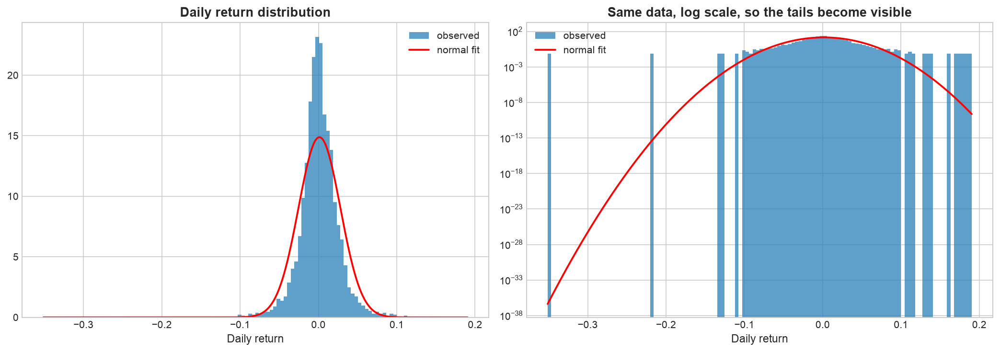
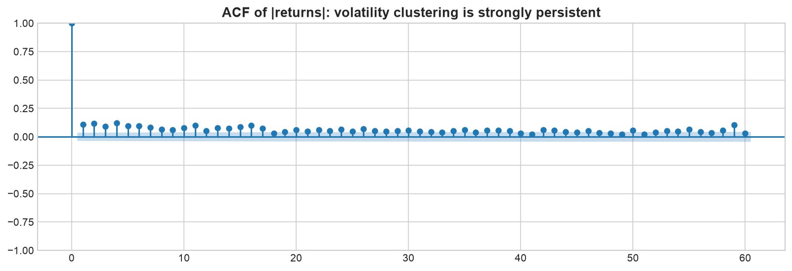
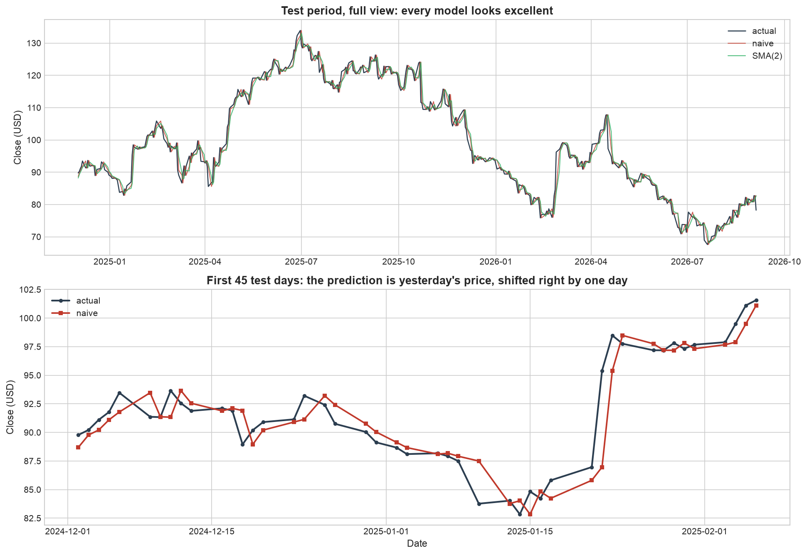
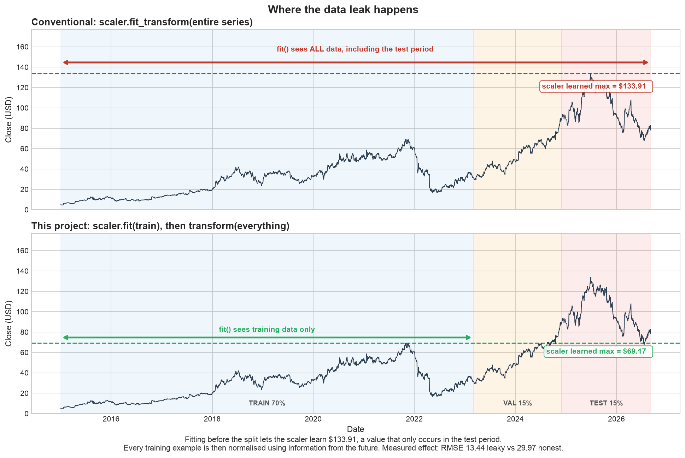
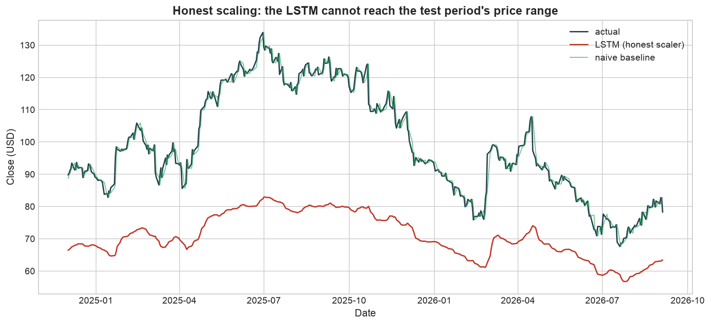
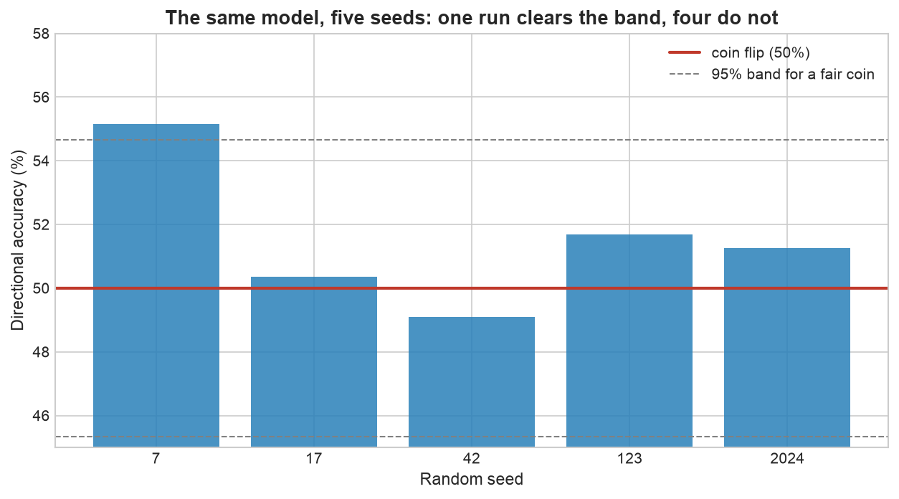

# Netflix (NFLX) Stock Price Forecasting

**Can a deep learning model predict Netflix's next day closing price better than assuming tomorrow
equals today?**

I built the models to find out: four statistical baselines, two ARIMA specifications, and three
LSTM variants, all scored on the same held out test period. The answer turned out to be no, and
the reason why is more interesting than the answer.

> **Headline result.** Across 441 test days, no model beat a naive "tomorrow equals today"
> forecast. One LSTM configuration appeared to, reaching 55.15% directional accuracy against a 50%
> coin flip with a one sided binomial p of 0.018. Retraining that identical model across five
> random seeds dropped the mean to 51.51% (p = 0.28), beating the baseline in one run out of five.
> **The edge was seed variance, not signal.**

Python · TensorFlow/Keras · statsmodels · scikit-learn · pandas

---

## Results

Every model, one test set, identical chronological splits. NFLX daily bars, 2015 to 2026, with the
final 15% held out.

| Model | RMSE | vs naive | MAE | MAPE % | Directional % |
|---|---|---|---|---|---|
| **Naive (persistence)** | **2.1295** | **1.000** | 1.4774 | 1.519 | no position |
| ARIMA(0,1,0) | 2.1295 | 1.000 | 1.4774 | 1.519 | no position |
| Drift | 2.1297 | 1.000 | 1.4776 | 1.519 | 49.31 |
| ARIMA(1,1,1) | 2.1303 | 1.000 | 1.4790 | 1.520 | 50.60 |
| LSTM (log returns, 5 seed mean) | 2.1295 | 1.000 | 1.4770 | 1.519 | 51.51 |
| EMA(2) | 2.2831 | 1.072 | 1.6070 | 1.647 | 50.57 |
| SMA(2) | 2.3957 | 1.125 | 1.6988 | 1.743 | 48.17 |
| LSTM (leaky scaler) | 13.4420 | 6.312 | 11.4099 | 10.696 | 50.57 |
| LSTM (price levels, honest scaler) | 29.9704 | 14.074 | 28.2839 | 27.654 | 51.02 |

A coin flip scores 50% on direction, with a standard error of ±2.38% over 441 days. Every model in
that column sits inside the band a fair coin produces.

Naive and ARIMA(0,1,0) show "no position" rather than a number because they predict no change at
all. A model that declines to make a directional claim cannot be scored on directional accuracy,
and putting a number there would be inventing one.

Reproduce the table:

```bash
python scripts/run_experiment.py
```

---

## What I found, and what it means

### 1. Classical model selection independently chose the naive forecast

I fitted a grid of six ARIMA specifications and let AIC pick. It selected **ARIMA(0,1,0)**, which
has no autoregressive terms and no moving average terms. Written out, that model is:

$$P_t = P_{t-1} + \varepsilon_t$$

which is a random walk, which is the naive forecast. Given a menu including several models with
real parameters, the information criterion chose the one with none.

The same thing happened when I tuned the moving average windows on validation data. Error rose
monotonically with window length, so the shortest window available won, and its limit as the window
shrinks to a single day is again the naive forecast. Three independent routes, unit root testing,
AIC, and hyperparameter tuning, all arrived at the same place.

### 2. Returns are not normally distributed, and it is not close



Left panel, linear axis: the normal fit looks reasonable. Right panel, same data on a log axis: the
observed bars extend far past where the fitted curve has effectively reached zero.

Counting the extreme days makes it concrete:

| Threshold | Observed days | A normal distribution predicts | Ratio |
|---|---|---|---|
| beyond 3 sigma | 47 | 7.92 | 5.9x |
| beyond 4 sigma | 17 | 0.19 | 91x |
| beyond 5 sigma | 10 | 0.002 | **5,943x** |

NFLX excess kurtosis is 17.1, where a normal distribution scores 0. Every peer I checked was
similarly fat tailed, so this is a property of equity returns rather than a Netflix quirk. Any
confidence interval or risk estimate built on normality understates crash risk, and understates it
by orders of magnitude in the far tail.

### 3. Direction is unpredictable, but magnitude is not

This is the most useful thing the analysis turned up.



| Series | Ljung-Box p at lag 1 | Interpretation |
|---|---|---|
| Returns (direction included) | 0.849 | no detectable structure |
| Absolute returns (magnitude only) | 0.000 | strong, persistent structure |

Yesterday's return says essentially nothing about today's. Yesterday's *move size* says a great
deal: volatility clusters, and the autocorrelation stays significant past sixty lags.

That split explains why this problem is hard in the specific way that it is. It also points at the
version of it that is tractable, which is forecasting volatility rather than direction.

I confirmed the underlying non-stationarity with two tests that have opposite null hypotheses, so
agreement between them is stronger evidence than either alone:

| Series | ADF p | KPSS p | Verdict |
|---|---|---|---|
| Close (price) | 0.699 | 0.01 | non-stationary |
| Log price | 0.198 | 0.01 | non-stationary |
| Log returns | 0.000 | 0.10 | **stationary** |

### 4. A lagged copy looks like an excellent forecast until you zoom in



Top panel is the full test period, where the naive forecast tracks the actual price so closely the
lines are hard to separate. Bottom panel is the first 45 days of the same data.

The prediction is not tracking the price. It is copying it one day late. Zoomed out that shift is
invisible and the fit looks superb, which is exactly why a chart like the top panel is not evidence
of anything.

### 5. Fixing the data leak made the model look worse, which is the point

The conventional approach to this problem fits a MinMaxScaler on the entire price series and only
afterwards splits into train and test. The scaler has then already seen the highest and lowest
prices of the test period before training starts.



Top panel is the conventional approach: `fit()` spans the whole series, so the scaler learns a
maximum of $133.91, a price that only ever occurs in the test period. Bottom panel is this project:
`fit()` stops at the training boundary and learns $69.17. Every training example in the top panel
is normalised using a number from the future.

I fitted the scaler on training data only, and enforced it with a unit test. Then I ran the leaky
version deliberately, changing nothing else, to measure what the bug is worth:

| Version | RMSE | vs naive |
|---|---|---|
| Scaler fitted on training data only | 29.97 | 14.1x |
| Scaler fitted on the full series | 13.44 | 6.3x |

**The leak roughly halves the reported error.** Same architecture, same seed, same splits, one line
different.



The honest version exposes what the leak was hiding. NFLX topped out near $69 in my training period
and reached $134 in the test period, so the test set lies almost entirely above anything the network
saw. A network trained on inputs scaled to [0, 1] cannot produce outputs near 2.0, so it
under-predicts by an average of $28 a day. Fitting the scaler on everything makes that symptom
vanish without fixing the cause.

The real fix is a different target. Prices are non-stationary and unbounded; log returns are
stationary and centred near zero. Predicting returns and converting back with
$\hat{P}_{t+1} = P_t e^{\hat{r}_{t+1}}$ removed the extrapolation problem entirely and brought RMSE
level with the baseline.

### 6. The apparent win was seed luck



The log return LSTM, trained once, reached 55.15% directional accuracy. That is 2.16 standard
errors above chance, one sided binomial p = 0.018. It looked like a genuine result and I was ready
to report it as one.

Then I retrained the identical model across five random seeds:

| Seed | RMSE | Directional % |
|---|---|---|
| 7 | 2.1259 | 55.15 |
| 17 | 2.1309 | 50.36 |
| 42 | 2.1311 | 49.10 |
| 123 | 2.1296 | 51.69 |
| 2024 | 2.1301 | 51.26 |
| **mean** | **2.1295** | **51.51** |

Mean directional accuracy 51.51%, p = 0.28, beating the naive RMSE in one run out of five. The mean
RMSE landed on the baseline to four decimal places.

Had I trained once and stopped, which is what the conventional implementation does, I would have
published a statistically significant directional edge that does not exist.

---

## Why this repository is built the way it is

Each safeguard targets a specific way of fooling yourself, and I added them because each one is
routinely skipped:

| Safeguard | The failure it prevents |
|---|---|
| Scaler fitted on training data only, with a unit test | Future minima and maxima leaking into training |
| Chronological splits, never shuffled | Training on the future and testing on the past |
| Baselines fitted on identical splits | Reporting an error with nothing to compare it against |
| Directional accuracy alongside RMSE | Low error on a trending series being mistaken for skill |
| Window parameters tuned on validation, never test | Fitting to the data you are about to be scored on |
| Rolling one step ahead ARIMA forecasts | Compounding errors making a fair comparison impossible |
| Seed sweep | Reporting one lucky draw as a result |

The seed sweep is the one that caught something here. That was not predictable in advance, which is
the argument for having all of them.

---

## Repository

```
netflix-stock-forecasting/
├── README.md                   <- this page
├── WALKTHROUGH.md              <- how I built it, step by step
├── PLAN.md                     <- the original execution plan
├── notebooks/
│   ├── 01_data_collection.ipynb
│   ├── 02_eda_market_analysis.ipynb
│   ├── 03_stationarity_and_features.ipynb
│   ├── 04_baselines_and_arima.ipynb
│   ├── 05_lstm.ipynb
│   └── 06_results.ipynb
├── src/                        <- importable, tested code the notebooks call into
│   ├── config.py               <- every tunable in one place
│   ├── data.py                 <- download and cache, with validation
│   ├── features.py             <- returns, moving averages, volatility, lags, calendar encoding
│   ├── windowing.py            <- leak free sequence construction
│   ├── diagnostics.py          <- ADF, KPSS, Ljung-Box
│   ├── evaluate.py             <- RMSE, MAE, MAPE, directional accuracy, lag correlation
│   ├── plots.py
│   └── models/
│       ├── baselines.py        <- naive, drift, SMA, EMA
│       ├── arima.py            <- AIC grid search, rolling one step ahead forecasts
│       └── lstm.py
├── scripts/run_experiment.py   <- reproduces the results table
├── tests/test_windowing.py     <- the leakage tests
├── reports/figures/            <- committed PNGs
└── docs/
    ├── SETUP.md                <- machine setup from scratch
    └── sources.md              <- annotated bibliography
```

The notebooks import from `src/` rather than defining logic inline, so the same code path runs in
the notebooks, in the tests, and in the reproduction script.

---

## Data and method

- **NFLX daily bars**, 2015-01-02 to present, 2,936 sessions, via `yfinance`
- **Peers** DIS, WBD, AMZN, SPY for correlation and risk comparison
- Prices are split and dividend adjusted (`auto_adjust=True`). NFLX split 7 for 1 in 2015 and 10
  for 1 in 2025, so unadjusted prices would show two artificial crashes of 86% and 90%
- Splits are chronological: **70% train, 15% validation, 15% test**, never shuffled
- Partial sessions are detected by volume and excluded, so an unfinished trading day never enters
  the data
- LSTM architecture is `LSTM(128) -> LSTM(64) -> Dense(25) -> Dense(1)`, Adam, mean squared error,
  60 day window, batch size 32, early stopping on validation loss with best weights restored

The architecture deliberately matches the conventional implementation of this project so that the
comparison is about protocol rather than about network design.

---

## Running it

```bash
git clone https://github.com/matthewpeters-extended/netflix-stock-forecasting.git
cd netflix-stock-forecasting
python3 -m venv .venv && source .venv/bin/activate
pip install -r requirements.txt
python scripts/run_experiment.py
```

Add `--skip-lstm` for the baselines and ARIMA only, which takes about three seconds. The full run
trains eight networks and takes a few minutes.

```bash
pytest tests/ -q
```

Setting up a machine from scratch, Homebrew through to Jupyter, is covered in
[`docs/SETUP.md`](docs/SETUP.md).

---

## What would actually be needed to do better

Not a bigger network. Daily closing prices carry very little forecastable information about
direction, which is what an efficient market implies and what the autocorrelation testing measured
directly.

- **Forecast volatility instead of direction.** Absolute returns are strongly autocorrelated out
  past sixty lags. GARCH style models handle that well, and it is genuinely tractable on this data.
- **Bring in information beyond price.** Earnings, subscriber numbers, news sentiment. Nothing here
  could have anticipated the 35% single day fall on 2022-04-20, because no model in this repository
  sees anything except past prices.
- **Higher frequency data**, where microstructure effects create short lived predictability.
- **Cross sectional models** ranking many stocks against each other rather than forecasting one in
  isolation.

## Limitations

- One ticker, so nothing here is validated across a universe of stocks
- One test period, which happens to contain the largest drawdown in the series
- Five seeds is enough to detect the variance, not to characterise it precisely
- No transaction costs, slippage, market impact or liquidity constraints, so directional accuracy
  would not translate into profit even if it were real
- Daily bars only, price and volume only
- Educational project. Not investment advice.

## Sources

Method references are credited in [`docs/sources.md`](docs/sources.md).
